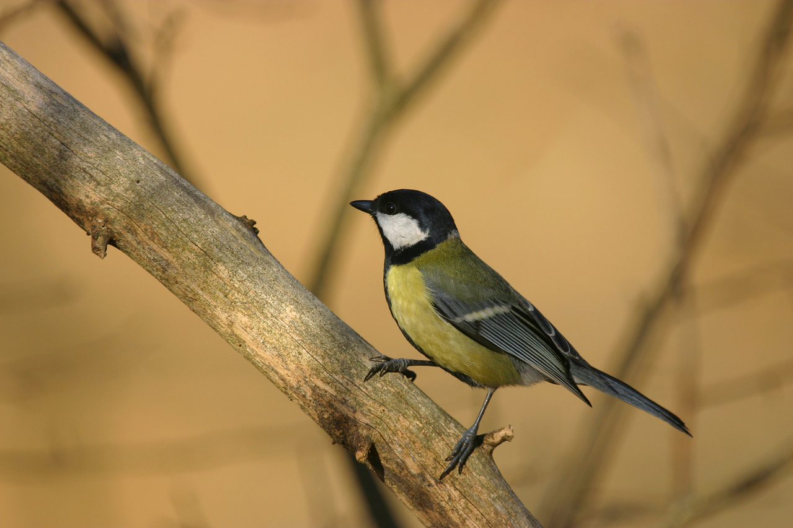

# kaggle: Cornell Birdcall Identification 


image source is [here](https://jp.freeimages.com/photo/bird-1361326)

Competition Link → https://www.kaggle.com/c/birdsong-recognition
## Leader Board Ranking
- public LB: 623th  
- private LB: 105th (blonze 🥉)

## competitonの概要
音声データをもとに、どの鳥の鳴き声かを推測するコンペ  
クラス数:264  
特徴としてはdomain shiftとnoise labelsが課題となるコンペだった。[本notebookより](https://www.kaggle.com/c/birdsong-recognition/discussion/183204)


## solution
### final model
[PANNS](https://www.kaggle.com/hidehisaarai1213/introduction-to-sound-event-detection)によるsingle model
epoch: 30  
予測時のthreshold: 0.9  

### extra data
[本discussion](https://www.kaggle.com/c/birdsong-recognition/discussion/159970)で公開されているextra dataをresamplingしてwavファイルに変換後、
各クラスの上限が100となるように訓練データを作成。学習時間はあまり増やしたくなかったので従来のデータ数である100を上限とした。
100に達していないクラスのデータを補強する意味合い。50でも試したがCVがかなり落ちたので100にした。

### augmentation
音声波形に対してp=0.3で以下を実施
- gaussian noise
- mixup noise　

noiseを加えるのが有効というdiscussionがあったので２種類のnoiseを追加

```
## mixup noise
通常のmixupのようにbatch内のデータでランダムに画像を重ね合わせる
ただしラベルは変更せず重ね合わせたデータをnoiseとして扱った。
また通常のmixupではbeta分布を用いているが、noiseがmainの画像よりweightが大きくなるのは避けたかったので
mainの画像のweightが0.7~0.9, noiseが0.1~0.3の割合となるような一様分布を使用
mixup noiseがprivate LBには効いていたと思われる
```
[Theoさんのソリューション](https://www.kaggle.com/c/birdsong-recognition/discussion/183199)にmodified mixupとあるがそれとは違う？


wave → log melspectrgram(画像)に変換後p=0.5で以下を実施
- specaugment
- holizontal flip


## その他試したけどうまくいかなかったもの
- mixup
- cutout
- 訓練データのdenoise  
時間がかなりかかるのと精度が音声によってバラバラのため断念
- テスト時のdenoise  
submission時にtimeout errorとなり不採用
- nocallを含む265クラスで学習・予測  
有効だったとのsolutionもあったが私の手元では効かなかった

## 実行できなかったアイデア
- 訓練時にrandomに取り出した音声内に鳥の鳴き声がない(peakがない)場合、nocallというラベルで上書きして学習(にのぴらさんのチームがこれでscoreが上がっていたみたい)
- site1,2とsite3で予測する音声の長さが異なるので別のモデルを作成する
- nocallとcall部分をまず分類し、その後別のモデルでcall部分を分類する


